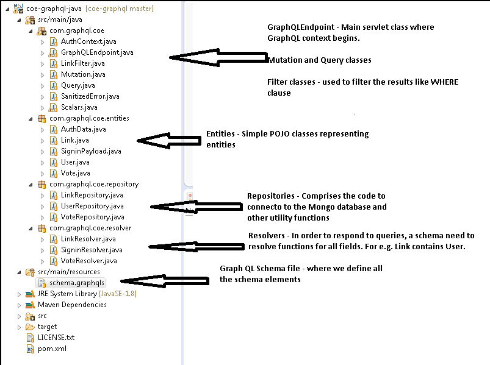

# **COE - GRAPH QL POINT-OF-VIEW**
This is the graphQL sample reference code built for the COE. In this code we are going to explore different options available within GraphQL. Here, we have mongo databas as our back-end and with the help of graph ql dependencies we are going to leverage GraphQL capability.

```
<dependency>
    <groupId>com.graphql-java</groupId>
    <artifactId>graphql-java</artifactId>
    <version>3.0.0</version>
</dependency>
<dependency>
    <groupId>com.graphql-java</groupId>
    <artifactId>graphql-java-tools</artifactId>
    <version>3.2.0</version>
</dependency>
<dependency>
    <groupId>com.graphql-java</groupId>
    <artifactId>graphql-java-servlet</artifactId>
    <version>4.0.0</version>
</dependency>
<dependency>
    <groupId>javax.servlet</groupId>
    <artifactId>javax.servlet-api</artifactId>
    <version>3.0.1</version>
    <scope>provided</scope>
</dependency>
```        
## PreRequisites
## Our use case 
We are dealing with 3 entities
- Users
- Links
- Votes
User can create some links where link entity has attributes such as description and link_url. A user can also vote on the particular link. 
We have build small use-cases around this where we are doing mutations and queries on the data-set.

## MongoDB Server
Make sure you are having a mongo db server running on local since we are using mongodb as our backend.
Just start the mongoDB server, server will wait for connections on port 28017. The Graph QL code which we have built will make a connection to port 28017. Make sure you are having database named coelinks created in the mongodb server. Within this database, our code will work with tables links, users and votes.

## Code Structure


## Building the project
Use the following command to build the project.
```
mvn clean install
```

## Running the Project
Run the project by the following mvn command by going into the folder .../graphql-java-master where the pom.xml is located. This will leverage the in-built jetty server to run our garpah ql server.
 ```    
mvn jetty:run 
 ```    
This will run the graph QL server on port 8080.
We have enabled this by adding the below mentioned lines into our pom.xml
```
<build>
    <finalName>hackernews</finalName>
    <plugins>
        <plugin>
            <groupId>org.eclipse.jetty</groupId>
            <artifactId>jetty-maven-plugin</artifactId>
            <version>9.4.6.v20170531</version>
        </plugin>
    </plugins>
</build>
```


## GraphiQL URLS and other details
GraphiQL is an in-browser IDE allowing you to explore the schema, fire queries/mutations and see the results. We can use this tool to play around the GraphQL.
Start Jetty server as mentioned in the previous step and open the below mentioned link. This link will give you the interface for GraphiQL.
```
http://localhost:8080/
```


## STEPS OF EXECUTION

### A) Disabling the Authorization for creation of Admin Account
Comment out the following code in the path ***com.graphql.coe.GraphQLEndPoint (Line number 64-73)***. We are doing this to first disable the authorization process to create a user. Ideally there should have been admin configured who is authorized to do this, but here for simplicity we are getting over with this workaround.
```
	/*@Override
    protected GraphQLContext createContext(Optional<HttpServletRequest> request, Optional<HttpServletResponse> response) {
        User user = request
                .map(req -> req.getHeader("Authorization"))
                .filter(id -> !id.isEmpty())
                .map(id -> id.replace("Bearer ", ""))
                .map(userRepository::findById)
                .orElse(null);
        return new AuthContext(user, request, response);
    }*/
```
### B) Create a user by using GraphiQL (localhost:8080)

***Request***
```
mutation createUser {
  createUser(
    name: "mohit",
	authProvider: {email: "mohit.mehrotra19@gmail.com", password: "mohit1"})
	{ id
	  name
	}
}
```

***Response***	
```	
{
  "data": {
	"createUser": {
		"id": "5c18b28c033ba41bd0fc2482",
		"name": "mohit"
	}
 }
}
```
	
### C) Sign-in with the user to get the token

***Request***
```
mutation signinUser {
   signinUser(auth: {email: "mohit.mehrotra19@gmail.com", password: "mohit1"}) 
      {
		token
		user {
			id
			name
		}
	 }
}
```
***Response***
```
{
 "data": {
   "signinUser": {
		"token": "5c18b28c033ba41bd0fc2482",
		"user": {
			"id": "5c18b28c033ba41bd0fc2482",
			"name": "mohit"
		}
	}
 }
}
```
### D) Go to the index.html (src/main/webapp/) - line number 117.
Change the Authorization code with the token recieved in the previous step. Also, uncomment the code coomented in ***step A)***.

### E) Run the server again with mvn jetty:run
   
   
### F) Queries for creating links (MUTATION SAMPLES)
***Request 1 For creating links***
```
mutation createLink {
	createLink(url: "mohit.sss", description: "my first link"){
		url
		description
	}
}
```
***Response 1 for creating links***
```
{
  "data": {
    "createLink": {
      "url": "mohit.sss",
      "description": "my first link"
    }
  }
}
```

***Request 2 Mutation for creating votes***
```
mutation createVote{
		createVote(
      linkId: "5c18b740033ba437344c8af1",
      userId: "5c18b28c033ba41bd0fc2482")
  {
			createdAt
			link {url}
      user {name}
			
	}
}  
```
***Response 2 for creating votes***
```
{
  "data": {
    "createVote": {
      "createdAt": "2019-01-25T02:54:30.31Z",
      "link": {
        "url": "mohit.sss"
      },
      "user": {
        "name": "mohit"
      }
    }
  }
}
```
***CREATE more such records through mutations to play around.***


### G) Queries for querying links (QUERY SAMPLE)
***Request 1 Normal query returning id, url and description***
```
query allLinks {
	allLinks{
		id
		url
		description
	}
}
```
***Response 1  Normal query returning id, url and description***
```
{
  "data": {
    "allLinks": [
      {
        "id": "5c18b740033ba437344c8af1",
        "url": "mohit.sss",
        "description": "my first link"
      },
      {
        "id": "5c18b753033ba437344c8af2",
        "url": "mohit.ttt",
        "description": "my second link"
      }
    ]
  }
}
```
***Request 2  Normal query returning id, url, description and posted by***
```
query allLinks {
	allLinks{
		id
		url
		description
		postedBy {
			name
		} 
	}
}
```
***Response 2 Normal query returning id, url, description and posted by***
```
{
  "data": {
    "allLinks": [
      {
        "id": "5c18b740033ba437344c8af1",
        "url": "mohit.sss",
        "description": "my first link",
        "postedBy": {
          "name": "mohit"
        }
      },
      {
        "id": "5c18b753033ba437344c8af2",
        "url": "mohit.ttt",
        "description": "my second link",
        "postedBy": {
          "name": "mohit"
        }
      }
    ]
  }
}
```
***Request 3 Returning first 2 links***
```
query allLinks {
		allLinks(first:2){
			id
			url
			description
			postedBy {
				name
			} 
	}
	}
```
***Response 3 Returning first 2 links***
```
{
  "data": {
    "allLinks": [
      {
        "id": "5c18b740033ba437344c8af1",
        "url": "mohit.sss",
        "description": "my first link",
        "postedBy": {
          "name": "mohit"
        }
      },
      {
        "id": "5c18b753033ba437344c8af2",
        "url": "mohit.ttt",
        "description": "my second link",
        "postedBy": {
          "name": "mohit"
        }
      }
    ]
  }
}
```
***Request 4 Employing filter on url***
```
query allLinks {
		allLinks(filter: {url_contains:"sss"}){
			id
			url
			description
			postedBy {
				name
			} 
	}
	}
```
***Response 4 Employing filter on url***
```
{
  "data": {
    "allLinks": [
      {
        "id": "5c18b740033ba437344c8af1",
        "url": "mohit.sss",
        "description": "my first link",
        "postedBy": {
          "name": "mohit"
        }
      }
    ]
  }
}
```
***Request 5 Employing filter on url and description***
```
query allLinks {
		allLinks(filter: {url_contains:"sss", description_contains:"first"}){
			id
			url
			description
			postedBy {
				name
			} 
	}
	}
```
***Response 5 Employing filter on url and description***
```
{
  "data": {
    "allLinks": [
      {
        "id": "5c18b740033ba437344c8af1",
        "url": "mohit.sss",
        "description": "my first link",
        "postedBy": {
          "name": "mohit"
        }
      }
    ]
  }
}
```
***Request 6 POST /customers : Creation of the Customer with the help of REST API at the backend***
```
mutation createCustomer {
	createCustomer(dob: "", emailId: "mark.twain@gmail.com", firstName: "Mark", lastName : "Twain", mobile: "123"){
		id
		firstName
    dob
	}
}
```
***Response 6 POST /customers : Creation of the customer with the help of REST API at the backend***
```
{
  "data": {
    "createCustomer": {
      "id": "1",
      "firstName": "Mark",
      "dob": ""
    }
  }
}
```
***Request 7 GET /customers : Getting all the customers with the help of REST API at the backend***
```
query allCustomers {
	allCustomers{
		id
		firstName		
	}
}
```
***Response 7 GET /customers : Getting all the customers with the help of REST API at the backend***
```
{
  "data": {
    "allCustomers": [
      {
        "id": "1",
        "firstName": "Mark"
      },
      {
        "id": "1",
        "firstName": "Stephan"
      }
    ]
  }
}
```
***Request 8 GET /customers?firstname_contains="Mark"  : Getting all the customers with the help of REST API at the backend based on the filter***
```
query allCustomers {
	allCustomers(filter: {firstname_contains:"Mark", lastname_contains: "Tw"}){
		id
		firstName
    lastName
	}
}
```
***Response 9 GET /customers?firstname_contains="Mark" : Getting all the customers with the help of REST API at the backend based on the filter***
```
{
  "data": {
    "allCustomers": [
      {
        "id": "1",
        "firstName": "Mark",
        "lastName": "Twain"
      }
    ]
  }
}
```
 ***Request 10 GET /customers/{customerId} : Getting a single customer from the backend REST API based on the customer id filter***
 ```
 query oneCustomer {
	oneCustomer(filter: {customerId:"1"}){
		id
		firstName
    lastName
	}
}
```
***Response 10 GET /customers/{customerId} : Getting a single customer from the backend REST API based on the customer id filter***
```
{
  "data": {
    "oneCustomer": {
      "id": "1",
      "firstName": "Mark",
      "lastName": "Twain"
    }
  }
}
```
 
	
	
